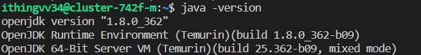

# Part1. 시작

**목차**
- [환경설정]()
- [실습 데이터 다운로드]()

---
### 환경설정

- 필요한 환경 & 패키지
  - 파이썬 
    
  - 주피터 노트북
    
  - 자바
    
  - 스파크 (pyspark 사용)
    

----
### 실습 데이터 다운로드

**실습 데이터**
- [뉴욕 TLC 트립 기록 데이터 다운로드](https://www.nyc.gov/site/tlc/about/tlc-trip-record-data.page) (2020년 3월 데이터 사용)


**데이터 설명**
- 뉴욕 tlc는 뉴욕시에서 택시, 운동차량, 플랫폼 공유 운송 서비스 및 기타 교통 서비스를 운영하고 감독하는 기관으로 이러한 서비스를 제공하는 운영자 및 기사들의 운행 기록을 수집하고 관리한다.
- 이 데이터는 뉴욕시에서 운행되는 택시 및 운동차량에 대한 여행 정보, 운전자 정보, 요금 정보 등을 포함한다.
- 이 데이터는 뉴욕시에서 교통 현황 및 교통 패턴을 이해하는 데 매우 유용하며, 운전자의 운행 기록 및 고객의 여행 패턴 등의 정보를 기반으로 많은 연구와 분석이 이루어지고 있다.

**주요 속성**
| 이름 | 설명| 예시 |
|--|---|---|
| hvfhs_license_num | 회사 면허 번호 | HV0005 |
| dispatching_base_num | 지역 라이센스 번호| B02510 |
| pickup_datetime | 택시 승차 시간 | 2020-03-01 00:03:40 |
| dropoff_datetime | 택시 하차 시간 | 2020-03-01 00:23:39 |
| PULocationID | 택시 승차 지역 ID | 81 |
| DOLocationID| 택시 하차 지역 ID | 159 |
| shared_request_flag| 합승 여부 Flag| N |

----

### 실습

**Spark Context 이해**


**SparkContext**
- Spark 클러스터와 연결시켜주는 객체
- Spark의 모든 기능에 접근할 수 있는 시작점
- Spark는 분산환경에서 동작하기 때문에 Driver Program 을 구동시키기 위해 `SparkContext`가 필요하다
- `SparkContext`는 프로그램당 하나만 만들 수 있고 사용후에는 종료된다.
- SparkContext 객체는 내부에 자바로 동작하는 Py4J의 SparkContext와 연결되며 이 덕분에 파이썬으로 코딩하면서도 JVM 위에서 동작하는 프로그램을 작성할 수 있다
- RDD를 만들 수 있다


**Spark 설정**

```python
# 패키지
from pyspark import SparkConf, SparkContext
import pandas as pd

conf = SparkConf().setMaster("local").setAppName("uber-date-trips")
sc = SparkContext(conf=conf)
```
- SparkConf - 사용자가 재정의해서 쓸 수 있는 설정 옵션들에 대한 키와 값을 갖고있는 객체
- setMaster("local") - 분산된 환경이 아닌 개발용 로컬 환경을 쓴다
- setAppName - Spark UI에서 확인 가능한 스파크 앱 이름


---
**데이터 로딩후 RDD 생성**

```python
# 데이터 위치
directory = "/home/ithingvv34/data-engineering/spark/data"
filename = "fhvhv_tripdata_2020-03.csv"

# 데이터 파싱
lines = sc.textFile(f"file:///{directory}/{filename}")
```


**필요 부분 추출**
```python
header = lines.first() 
filtered_lines = lines.filter(lambda row: row != header) 
```


**날짜 전처리: countByValue로 같은 날짜 등장하는 부분을 센다**
```python
dates = filtered_lines.map(lambda x: x.split(",")[2].split(" ")[0])
```


**CountByValue**
```python
result = dates.countByValue()
```


**CSV로 결과값 저장**
```python
pd.Series(result, name="trips").to_csv("trips_date.csv")
```

**Spark 작업 실행**
- Spark cluster manager에게 작업을 제출
```bash
spark-submit count_trips.py
```


- 결과
```txt
,trips
2020-03-01,784246
2020-03-02,648986
2020-03-03,697880
2020-03-04,707879
2020-03-05,731165
...
```

**차트로 그리기**
- 대략 3월 10일 이후로 택시 승객이 감소하는 추세를 보여준다.


----


