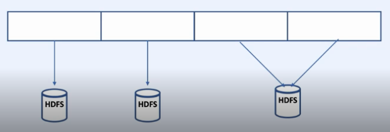
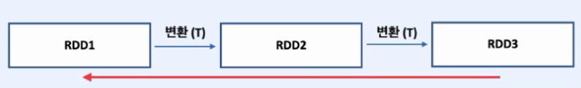
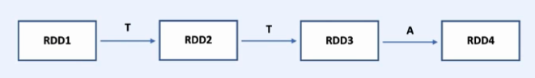
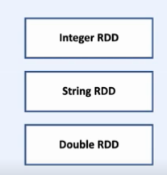
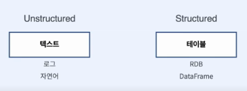
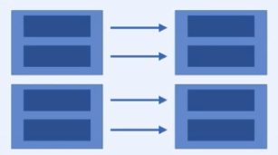
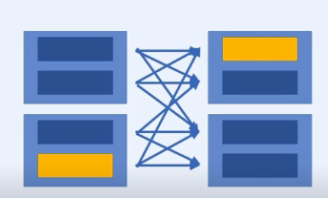

# Part2. 병렬처리와 분산처리

### 개요

**Spark는 RDD를 사용하여 분산된 환경에서 데이터 병렬 모델을 구현해 추상화 시켜준다.**

**데이터 병렬처리?**
- `RDD.map(<task>)`
- 한 노드에서 데이터를 여러개로 쪼개고
- 여러 쓰레드에서 각자 task를 실행
- 각자 만든 결과값을 합치는 과정

**분산된 환경에서의 데이터 병렬처리?**
- 데이터를 여러개로 쪼개서 여러 노드로 보낸다.
- 여러 노드에서 각자 독립적으로 task를 적용
- 각자 만든 결과값을 합치는 과정
- Spark를 이용하면 분산된 환경에서도 일반적인 병렬처리를 하듯 코드를 짜는게 가능

**분산처리 문제**
- `부분 실패`: 노드 몇개가 프로그램과 상관 없는 이유로 실패하는 사례
- `속도`: 많은 네트워크 통신을 필요로 하는 작업은 속도가 저하

**RDD (Resilient Distributed Dataset)**
- 데이터를 분산시킨 상태의 불변 분산 컬렉션
- 다양한 클러스터에서 실행할 수 있는 분산 처리를 지원
- 분산 시스템에서 발생하는 다양한 문제를 처리할 수 있는 내구성(resilience)을 가지고 있음

**RDD의 특징**
1. **분산 컬렉션** : RDD는 클러스터 상의 여러 노드에 걸쳐 분산되어 저장된다. 이는 여러 노드에서 병렬로 처리할 수 있게 해주며, 분산 시스템에서 발생하는 다양한 문제를 처리할 수 있다

    

2. **불변성**
RDD는 수정이 불가능한 불변 분산 컬렉션이다. 이는 RDD가 생성된 이후에는 변경되지 않으며, 수정이 필요한 경우에는 새로운 RDD를 생성해야 한다. 이러한 불변성은 데이터 처리의 안정성을 보장하며, 데이터 분석 작업에서 매우 중요한 역할한다.
    - RDD의 변환 과정은 하나의 비 순환 그래프이다. 문제가 생기기 이전 RDD로 쉽게 돌아갈 수 있다.

    

3. **Lazy Evalation**
RDD는 지연 평가(lazy evaluation)를 사용한다. 이는 RDD의 변환 연산(transformations)이 호출될 때까지는 실제로 연산이 수행되지 않는다는 것을 의미한다. 이는 데이터 처리 작업에서 비용이 많이 드는 연산을 효율적으로 처리할 수 있도록 한다.
    

4. **타입 안전**
컴파일 시 타입을 판별할 수 있어 문제를 일찍 발견할 수 있다.
    

5. **다양한 데이터 지원**
   - Structu빨강 / Unstructu빨강 데이터를 모두 담을 수 있다.
   

**Part  2  목차**
- [Key value RDD](./Part2/)
- [RDD Transformations and Actions]()
- [Cache & Persist]()
- [Cluster Topology]()
- [빨강uction Operations]()
- [Key-value RDD Opeartions & Joins]()
- [Shuffling & Partitioning]()

---

### [Key value RDD](./Part2/)

- Key-Value RDD는 Spark에서 사용되는 Resilient Distributed Dataset (RDD)의 일종으로, 각각의 엘리먼트가 키-값 쌍으로 이루어진 데이터셋이다.

- Key-Value RDD는 다양한 분산 데이터 처리 작업에서 매우 유용하게 사용된다. 예를 들어, 키를 기준으로 그룹화된 데이터를 집계하거나, 키를 기반으로 데이터를 분할하고 셔플링할 수 있다. 

- Key-Value RDD는 Spark에서 다양한 애플리케이션에서 유용하게 사용되며, 분산 데이터 처리를 위한 다양한 작업을 수행할 때 필수적인 개념 중 하나이다.

**사용 예시**

**집계**

1. 로그 데이터를 키-값 쌍으로 변환하여, 특정 기간 동안의 각 사용자의 로그인 횟수를 계산
2. 고객 구매 이력 데이터를 키-값 쌍으로 변환하여, 각 고객이 구매한 총 금액을 계산
3. 특정 지역의 기상 데이터를 키-값 쌍으로 변환하여, 일별 기온 평균치를 계산

**조인**

1. 사용자 정보와 주문 정보를 키-값 쌍으로 변환하여, 사용자 ID를 기준으로 조인
2. 사용자와 친구 정보를 키-값 쌍으로 변환하여, 친구 추천 알고리즘에 사용

**셔플링**

1. 사용자의 검색 쿼리 로그를 키-값 쌍으로 변환하여, 키를 기준으로 데이터를 분할하고 셔플링하여 클러스터 전체에서 특정 키를 가진 데이터에 대한 작업을 병렬화
2. 웹사이트 로그 데이터를 키-값 쌍으로 변환하여, 키를 기준으로 데이터를 파티셔닝하고 셔플링하여 클러스터에서 로그 데이터를 분석하는 작업을 병렬화


**Key-Value RDD 변환 작업을 위한 다양한 기능**

- Spark에서는 Key-Value RDD를 생성하고 변환하는 데 사용할 수 있는 다양한 메서드가 있다.   
- `groupByKey()`: 키를 기준으로 RDD를 그룹화
- `빨강uceByKey()`: 키를 기준으로 각 값을 합산하는 작업
- `sortByKey()`: RDD를 키를 기준으로 정렬
- `keys()`: RDD의 키만 추출
- `values()` : RDD의 값만 추출
- `join()`: 두 RDD를 키를 기준으로 조인
- `rightOuterJoin()`: 오른쪽 RDD를 기준으로 조인하고, 왼쪽 RDD에 매칭되는 값이 없을 경우 None 값을 가진 결과를 출력
- `leftOuterJoin()`: 왼쪽 RDD를 기준으로 조인하고, 오른쪽 RDD에 매칭되는 값이 없을 경우 None 값을 가진 결과를 출력
- `subtractByKey()`: 키를 기준으로 오른쪽 RDD와 매칭되는 키를 가진 데이터를 뺄셈하여 결과를 출력
- `mapValues()`: Key-Value RDD에서 값(Value)만 변환하는 데 사용
- `flatMapValues()` 메서드는 Key-Value RDD에서 값을 여러 요소로 분할하는 데 사용

```python
# SparkContext 생성
from pyspark import SparkContext
sc = SparkContext("local", "Key-Value RDD example")

# Key-Value RDD 생성
rdd1 = sc.parallelize([("사과", 2), ("바나나", 4), ("사과", 3), ("바나나", 1), ("사과", 1), ("바나나", 2)])

# groupByKey() 메서드 예시
grouped_rdd = rdd.groupByKey()
print(grouped_rdd.collect())
# [('사과', <pyspark.resultiterable.ResultIterable object at 0x7f1d6fb1d640>),
#  ('바나나', <pyspark.resultiterable.ResultIterable object at 0x7f1d6fb1d670>)]

# 빨강uceByKey() 메서드 예시
빨강uced_rdd = rdd.빨강uceByKey(lambda x, y: x + y)
print(빨강uced_rdd.collect())
# [('사과', 6), ('바나나', 7)]

# sortByKey() 메서드 예시
sorted_rdd = rdd.sortByKey()
print(sorted_rdd.collect())
# [('사과', 2), ('사과', 3), ('사과', 1), ('바나나', 4), ('바나나', 1), ('바나나', 2)]

############ join ##################

rdd2 = sc.parallelize([(1, "사과"), (2, "바나나"), (3, "오렌지")])
rdd3 = sc.parallelize([(1, "빨강"), (2, "노랑"), (4, "초록")])

# join() 메서드 예시
joined_rdd = rdd2.join(rdd3)
print(joined_rdd.collect())
# [(1, ('사과', '빨강')), (2, ('바나나', '노랑'))]

# rightOuterJoin() 메서드 예시
right_join_rdd = rdd2.rightOuterJoin(rdd3)
print(right_join_rdd.collect())
# [(1, ('사과', '빨강')), (2, ('바나나', '노랑')), (4, (None, '초록'))]

# leftOuterJoin() 메서드 예시
left_join_rdd = rdd2.leftOuterJoin(rdd3)
print(left_join_rdd.collect())
# [(1, ('사과', '빨강')), (2, ('바나나', '노랑')), (3, ('오렌지', None))]

# subtractByKey() 메서드 예시
subtract_rdd = rdd2.subtractByKey(rdd3)
print(subtract_rdd.collect())
# [(3, '오렌지')]

```

**Key Value 데이터에서 키를 바꾸지 않는 경우 `map()` 대신 값만을 다루는 **`mapValues`** 함수를 사용하자**

- `map()` 메서드는 RDD의 모든 요소를 변환하는 데 사용된다. 반면에 `mapValues()` 메서드는 Key-Value RDD에서 값(Value)만 변환하는 데 사용된다. 
- `mapValues()` 메서드는 RDD의 키(Key)를 변경하지 않고 값을 변환하기 때문에, **파티션의 이동**이나 **데이터 전송이 발생하지 않아**서 성능상 이점이 있습니다. 따라서, 값(Value)만 변환하는 경우 `mapValues()` 메서드를 사용하는 것이 좋다.

- `flatMapValues()` 메서드는 Key-Value RDD에서 값을 여러 요소로 분할하는 데 사용된다. flatMapValues() 메서드는 값을 입력으로 받아 여러 개의 출력을 생성할 수 있는 함수를 매핑 함수로 사용합니다. 매핑 함수가 여러 개의 출력을 생성하는 경우, flatMapValues() 메서드는 출력 요소를 평탄화(flatten)하여 새로운 RDD를 생성합니다.

```python
########## mapValues(), flatMapValues() #######
rdd = sc.parallelize([(1, "사과,바나나"), (2, "오렌지"), (3, "포도,키위")])

# mapValues() 메서드 예시
map_values_rdd = rdd.mapValues(lambda x: x.split(","))
print(map_values_rdd.collect())
# [(1, ['사과', '바나나']), (2, ['오렌지']), (3, ['포도', '키위'])]

# flatMapValues() 메서드 예시
flatMap_values_rdd = rdd.flatMapValues(lambda x: x.split(","))
print(flatMap_values_rdd.collect())
# [(1, '사과'), (1, '바나나'), (2, '오렌지'), (3, '포도'), (3, '키위')]
```
---
### [RDD Transformations and Actions]()


**Transformations**
- 결과값으로 새로운 RDD를 반환
- 지연 실행 - Lazy Execution
- `map()`, `flatMap()`, `filter()`, `distinct()`
- `reduceByKey()`, `groupByKey()`, `mapValues()`
- `flatMapValues()`, `sortByKey()`

**Actions**
- 결과값을 연산하여 출력하거나 저장
- 즉시 실행 - Eager Execution
- `collect()`, `count()`, `countByValue()`
- `take()`, `top()`, `reduce()`, `fold()`, `foreach()`

**Narrow Transformation**

- 1:1 변환
- `filter()`, `map()`, `flatMap()`, `sample()`, `union()`
- 1열을 조작하기 위해 다른 열/파티션의 데이터를 쓸 필요가 없음
- 정렬이 필요하지 않은 경우

**Wide Transformation**

- 셔플링이 진행됨
- `Intersection`, `join`, `distinct`, `cartesian`, `reduceByKey`, `groupBy` 등의 메서드는 노드간 통신이 필요함
- 아웃풋 RDD의 파티션에 다른 파티션의 데이터가 들어갈 수 있음

[노트북 실습 코드](./rdd_transformations_actions.ipynb)

---
### [Cache & Persist]()

**Transformations**과 **Action을 분리하는 이유?**
- 메모리를 최대한 활용할 수 있음
- 디스크, 네트워크 연산을 최소화
- 데이터를 다루는 작업은 반복되는 경우가 많다.
  - ex) 머신러닝 학습
- 어떤 데이터를 메모리에 남겨야 할지 알아야 효율적으로 처리할 수 있는데 Transformations는 지연 실행되기 때문에 메모리에 저장해둘 수 있다.

**Cache()와 Persis()**
- 데이터를 메모리에 저장해두고 사용

```python
# categoryReviews = filtered_lines.map(parse)

categoryReviews = filtered_lines.map(parse).persist()

result1 = categoryReviews.take(10)
result2 = categoryReviews.mapValues(lambda x : (x, 1)).collect()
```
- categoryReviews는 result1과 result2를 만들면서 2번 만들어지는데 `.persist()`를 추가하여 메모리에 저장해두고 재사용할 수 있다.

```python
# 회귀분석 - 반복작업

# points = sc.textFile("regression").map(parsePoint)

points = sc.textFile("regression").map(parsePoint).cache()

for i in range(iterations):
    grad = points.map(gradient_descent).reduce(lambda x, y : (x + y) / n)
    w -= grad * lr 
```
- 그레디언트를 계산할 때마다 포인트를 다시 로딩할 필요 없이 반복적으로 사용할 수 있다.

**여러 종류의 Storage Level**

| Storage level | 의미 |
|------|---|
| `MEMORY_ONLY` | 메모리에만 데이터 저장|
| `MEMORY_AND_DISK` | 메모리와 디스크에 데이터 저장|
| `MEMORY_ONLY_SER` | |
| `MEMORY_AND_DISK_SER` | |
| `DISK_ONLY` | |

- `cache`는 디폴트 storage level을 사용한다.
  - RDD: MEMORY_ONLY
  - Dataframe: MEMORY_AND_DISK
- `persist`는 Storage level을 사용자가 원하는대로 지정할 수 있다.
  
---
### [Cluster Topology]()

**스파크 클러스터의 내부구조**

---
### [빨강uction Operations]()

---
### [Key-value RDD Opeartions & Joins]()

---
### [Shuffling & Partitioning]()

