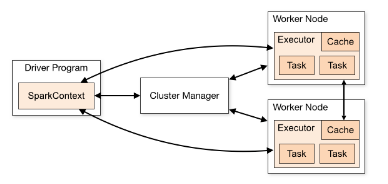
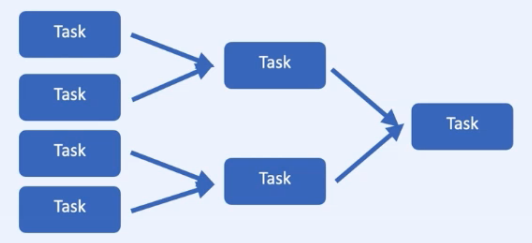
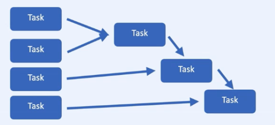
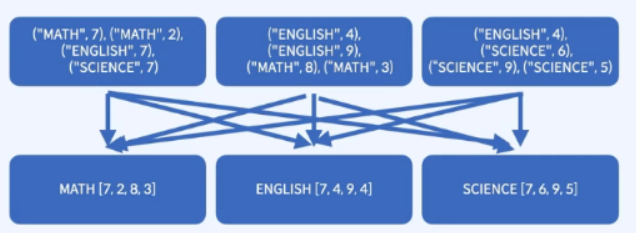
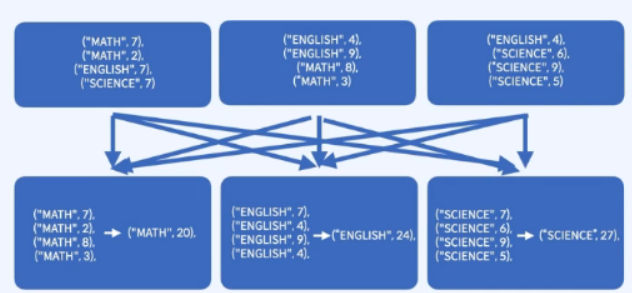
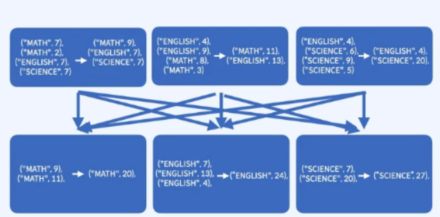
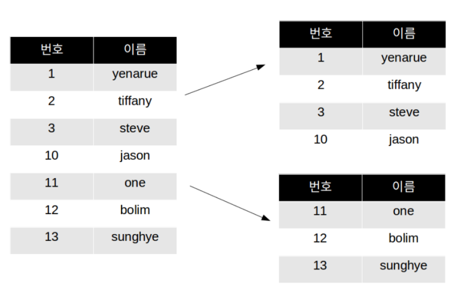

# Part2. 병렬처리와 분산처리

### 개요

**Spark는 RDD를 사용하여 분산된 환경에서 데이터 병렬 모델을 구현해 추상화 시켜준다.**

**데이터 병렬처리?**
- `RDD.map(<task>)`
- 한 노드에서 데이터를 여러개로 쪼개고
- 여러 쓰레드에서 각자 task를 실행
- 각자 만든 결과값을 합치는 과정

**분산된 환경에서의 데이터 병렬처리?**
- 데이터를 여러개로 쪼개서 여러 노드로 보낸다.
- 여러 노드에서 각자 독립적으로 task를 적용
- 각자 만든 결과값을 합치는 과정
- Spark를 이용하면 분산된 환경에서도 일반적인 병렬처리를 하듯 코드를 짜는게 가능

**분산처리 문제**
- `부분 실패`: 노드 몇개가 프로그램과 상관 없는 이유로 실패하는 사례
- `속도`: 많은 네트워크 통신을 필요로 하는 작업은 속도가 저하

**RDD (Resilient Distributed Dataset)**
- 데이터를 분산시킨 상태의 불변 분산 컬렉션
- 다양한 클러스터에서 실행할 수 있는 분산 처리를 지원
- 분산 시스템에서 발생하는 다양한 문제를 처리할 수 있는 내구성(resilience)을 가지고 있음

**RDD의 특징**
1. **분산 컬렉션** : RDD는 클러스터 상의 여러 노드에 걸쳐 분산되어 저장된다. 이는 여러 노드에서 병렬로 처리할 수 있게 해주며, 분산 시스템에서 발생하는 다양한 문제를 처리할 수 있다

    

2. **불변성**
RDD는 수정이 불가능한 불변 분산 컬렉션이다. 이는 RDD가 생성된 이후에는 변경되지 않으며, 수정이 필요한 경우에는 새로운 RDD를 생성해야 한다. 이러한 불변성은 데이터 처리의 안정성을 보장하며, 데이터 분석 작업에서 매우 중요한 역할한다.
    - RDD의 변환 과정은 하나의 비 순환 그래프이다. 문제가 생기기 이전 RDD로 쉽게 돌아갈 수 있다.

    

3. **Lazy Evalation**
RDD는 지연 평가(lazy evaluation)를 사용한다. 이는 RDD의 변환 연산(transformations)이 호출될 때까지는 실제로 연산이 수행되지 않는다는 것을 의미한다. 이는 데이터 처리 작업에서 비용이 많이 드는 연산을 효율적으로 처리할 수 있도록 한다.
    

4. **타입 안전**
컴파일 시 타입을 판별할 수 있어 문제를 일찍 발견할 수 있다.
    

5. **다양한 데이터 지원**
   - Structu빨강 / Unstructu빨강 데이터를 모두 담을 수 있다.
   

**Part  2  목차**
- [Key value RDD](./Part2/)
- [RDD Transformations and Actions]()
- [Cache & Persist]()
- [Cluster Topology]()
- [빨강uction Operations]()
- [Key-value RDD Opeartions & Joins]()
- [Shuffling & Partitioning]()

---

### [Key value RDD](./Part2/)

- Key-Value RDD는 Spark에서 사용되는 Resilient Distributed Dataset (RDD)의 일종으로, 각각의 엘리먼트가 키-값 쌍으로 이루어진 데이터셋이다.

- Key-Value RDD는 다양한 분산 데이터 처리 작업에서 매우 유용하게 사용된다. 예를 들어, 키를 기준으로 그룹화된 데이터를 집계하거나, 키를 기반으로 데이터를 분할하고 셔플링할 수 있다. 

- Key-Value RDD는 Spark에서 다양한 애플리케이션에서 유용하게 사용되며, 분산 데이터 처리를 위한 다양한 작업을 수행할 때 필수적인 개념 중 하나이다.

**사용 예시**

**집계**

1. 로그 데이터를 키-값 쌍으로 변환하여, 특정 기간 동안의 각 사용자의 로그인 횟수를 계산
2. 고객 구매 이력 데이터를 키-값 쌍으로 변환하여, 각 고객이 구매한 총 금액을 계산
3. 특정 지역의 기상 데이터를 키-값 쌍으로 변환하여, 일별 기온 평균치를 계산

**조인**

1. 사용자 정보와 주문 정보를 키-값 쌍으로 변환하여, 사용자 ID를 기준으로 조인
2. 사용자와 친구 정보를 키-값 쌍으로 변환하여, 친구 추천 알고리즘에 사용

**셔플링**

1. 사용자의 검색 쿼리 로그를 키-값 쌍으로 변환하여, 키를 기준으로 데이터를 분할하고 셔플링하여 클러스터 전체에서 특정 키를 가진 데이터에 대한 작업을 병렬화
2. 웹사이트 로그 데이터를 키-값 쌍으로 변환하여, 키를 기준으로 데이터를 파티셔닝하고 셔플링하여 클러스터에서 로그 데이터를 분석하는 작업을 병렬화


**Key-Value RDD 변환 작업을 위한 다양한 기능**

- Spark에서는 Key-Value RDD를 생성하고 변환하는 데 사용할 수 있는 다양한 메서드가 있다.   
- `groupByKey()`: 키를 기준으로 RDD를 그룹화
- `reduceByKey()`: 키를 기준으로 각 값을 합산하는 작업
- `sortByKey()`: RDD를 키를 기준으로 정렬
- `keys()`: RDD의 키만 추출
- `values()` : RDD의 값만 추출
- `join()`: 두 RDD를 키를 기준으로 조인
- `rightOuterJoin()`: 오른쪽 RDD를 기준으로 조인하고, 왼쪽 RDD에 매칭되는 값이 없을 경우 None 값을 가진 결과를 출력
- `leftOuterJoin()`: 왼쪽 RDD를 기준으로 조인하고, 오른쪽 RDD에 매칭되는 값이 없을 경우 None 값을 가진 결과를 출력
- `subtractByKey()`: 키를 기준으로 오른쪽 RDD와 매칭되는 키를 가진 데이터를 뺄셈하여 결과를 출력
- `mapValues()`: Key-Value RDD에서 값(Value)만 변환하는 데 사용
- `flatMapValues()` 메서드는 Key-Value RDD에서 값을 여러 요소로 분할하는 데 사용

```python
# SparkContext 생성
from pyspark import SparkContext
sc = SparkContext("local", "Key-Value RDD example")

# Key-Value RDD 생성
rdd1 = sc.parallelize([("사과", 2), ("바나나", 4), ("사과", 3), ("바나나", 1), ("사과", 1), ("바나나", 2)])

# groupByKey() 메서드 예시
grouped_rdd = rdd.groupByKey()
print(grouped_rdd.collect())
# [('사과', <pyspark.resultiterable.ResultIterable object at 0x7f1d6fb1d640>),
#  ('바나나', <pyspark.resultiterable.ResultIterable object at 0x7f1d6fb1d670>)]

# reduceByKey() 메서드 예시
reduced_rdd = rdd.reduceByKey(lambda x, y: x + y)
print(reduced_rdd.collect())
# [('사과', 6), ('바나나', 7)]

# sortByKey() 메서드 예시
sorted_rdd = rdd.sortByKey()
print(sorted_rdd.collect())
# [('사과', 2), ('사과', 3), ('사과', 1), ('바나나', 4), ('바나나', 1), ('바나나', 2)]

############ join ##################

rdd2 = sc.parallelize([(1, "사과"), (2, "바나나"), (3, "오렌지")])
rdd3 = sc.parallelize([(1, "빨강"), (2, "노랑"), (4, "초록")])

# join() 메서드 예시
joined_rdd = rdd2.join(rdd3)
print(joined_rdd.collect())
# [(1, ('사과', '빨강')), (2, ('바나나', '노랑'))]

# rightOuterJoin() 메서드 예시
right_join_rdd = rdd2.rightOuterJoin(rdd3)
print(right_join_rdd.collect())
# [(1, ('사과', '빨강')), (2, ('바나나', '노랑')), (4, (None, '초록'))]

# leftOuterJoin() 메서드 예시
left_join_rdd = rdd2.leftOuterJoin(rdd3)
print(left_join_rdd.collect())
# [(1, ('사과', '빨강')), (2, ('바나나', '노랑')), (3, ('오렌지', None))]

# subtractByKey() 메서드 예시
subtract_rdd = rdd2.subtractByKey(rdd3)
print(subtract_rdd.collect())
# [(3, '오렌지')]

```

**Key Value 데이터에서 키를 바꾸지 않는 경우 `map()` 대신 값만을 다루는 **`mapValues`** 함수를 사용하자**

- `map()` 메서드는 RDD의 모든 요소를 변환하는 데 사용된다. 반면에 `mapValues()` 메서드는 Key-Value RDD에서 값(Value)만 변환하는 데 사용된다. 
- `mapValues()` 메서드는 RDD의 키(Key)를 변경하지 않고 값을 변환하기 때문에, **파티션의 이동**이나 **데이터 전송이 발생하지 않아**서 성능상 이점이 있다. 따라서, 값(Value)만 변환하는 경우 `mapValues()` 메서드를 사용하는 것이 좋다.

- `flatMapValues()` 메서드는 Key-Value RDD에서 값을 여러 요소로 분할하는 데 사용된다. flatMapValues() 메서드는 값을 입력으로 받아 여러 개의 출력을 생성할 수 있는 함수를 매핑 함수로 사용한다. 매핑 함수가 여러 개의 출력을 생성하는 경우, flatMapValues() 메서드는 출력 요소를 평탄화(flatten)하여 새로운 RDD를 생성한다.

```python
########## mapValues(), flatMapValues() #######
rdd = sc.parallelize([(1, "사과,바나나"), (2, "오렌지"), (3, "포도,키위")])

# mapValues() 메서드 예시
map_values_rdd = rdd.mapValues(lambda x: x.split(","))
print(map_values_rdd.collect())
# [(1, ['사과', '바나나']), (2, ['오렌지']), (3, ['포도', '키위'])]

# flatMapValues() 메서드 예시
flatMap_values_rdd = rdd.flatMapValues(lambda x: x.split(","))
print(flatMap_values_rdd.collect())
# [(1, '사과'), (1, '바나나'), (2, '오렌지'), (3, '포도'), (3, '키위')]
```
---
### [RDD Transformations and Actions]()


**Transformations**
- 결과값으로 새로운 RDD를 반환
- 지연 실행 - Lazy Execution
- `map()`, `flatMap()`, `filter()`, `distinct()`
- `reduceByKey()`, `groupByKey()`, `mapValues()`
- `flatMapValues()`, `sortByKey()`

**Actions**
- 결과값을 연산하여 출력하거나 저장
- 즉시 실행 - Eager Execution
- `collect()`, `count()`, `countByValue()`
- `take()`, `top()`, `reduce()`, `fold()`, `foreach()`

**Narrow Transformation**

- 1:1 변환
- `filter()`, `map()`, `flatMap()`, `sample()`, `union()`
- 1열을 조작하기 위해 다른 열/파티션의 데이터를 쓸 필요가 없음
- 정렬이 필요하지 않은 경우

**Wide Transformation**

- 셔플링이 진행됨
- `Intersection`, `join`, `distinct`, `cartesian`, `reduceByKey`, `groupBy` 등의 메서드는 노드간 통신이 필요함
- 아웃풋 RDD의 파티션에 다른 파티션의 데이터가 들어갈 수 있음

[노트북 실습 코드](./rdd_transformations_actions.ipynb)

---
### [Cache & Persist]()

**Transformations**과 **Action을 분리하는 이유?**
- 메모리를 최대한 활용할 수 있음
- 디스크, 네트워크 연산을 최소화
- 데이터를 다루는 작업은 반복되는 경우가 많다.
  - ex) 머신러닝 학습
- 어떤 데이터를 메모리에 남겨야 할지 알아야 효율적으로 처리할 수 있는데 Transformations는 지연 실행되기 때문에 메모리에 저장해둘 수 있다.

**Cache()와 Persis()**
- 데이터를 메모리에 저장해두고 사용

```python
# 새egoryReviews = filtered_lines.map(parse)

새egoryReviews = filtered_lines.map(parse).persist()

result1 = 새egoryReviews.take(10)
result2 = 새egoryReviews.mapValues(lambda x : (x, 1)).collect()
```
- 새egoryReviews는 result1과 result2를 만들면서 2번 만들어지는데 `.persist()`를 추가하여 메모리에 저장해두고 재사용할 수 있다.

```python
# 회귀분석 - 반복작업

# points = sc.textFile("regression").map(parsePoint)

points = sc.textFile("regression").map(parsePoint).cache()

for i in range(iterations):
    grad = points.map(gradient_descent).reduce(lambda x, y : (x + y) / n)
    w -= grad * lr 
```
- 그레디언트를 계산할 때마다 포인트를 다시 로딩할 필요 없이 반복적으로 사용할 수 있다.

**여러 종류의 Storage Level**

| Storage level | 의미 |
|------|---|
| `MEMORY_ONLY` | 메모리에만 데이터 저장|
| `MEMORY_AND_DISK` | 메모리와 디스크에 데이터 저장|
| `MEMORY_ONLY_SER` | |
| `MEMORY_AND_DISK_SER` | |
| `DISK_ONLY` | |

- `cache`는 디폴트 storage level을 사용한다.
  - RDD: MEMORY_ONLY
  - Dataframe: MEMORY_AND_DISK
- `persist`는 Storage level을 사용자가 원하는대로 지정할 수 있다.
  
---
### [Cluster Topology]()

**스파크 클러스터의 구조**



Spark 클러스터는 작업을 Worker Node에 분산하고 Master 노드에서 결과를 집계하여 대규모 데이터를 처리하는 Master-Worker Topology를 활용하는 분산 시스템이다.

RDD을 효율적으로 사용하기 위해서는 **Transformations**와 **Action**을 이해하고 메소드가 클러스터의 어떤 부분에서 실행되는지 인지하고 코딩하는 것이 중요하다.

---
**1. Driver Program**

드라이버 프로그램은 마스터 노드에서 실행되며 Spark 애플리케이션의 실행을 조정하고 작업이 워커 노드에서 효율적으로 실행되도록 조정하는 역할을 한다.
- **SparkContext 생성**
  -  Spark 애플리케이션의 진입점 역할을 하고 클러스터 관리자에 대한 액세스를 제공하는 SparkContext를 생성한다.
- **계산 정의**
  -  실행해야 하는 작업의 방향성 비순환 그래프(DAG)를 생성하여 수행해야 하는 계산을 정의한다.
- **작업 나누기**
  -  계산을 워커노드에서 병렬로 실행할 수 있는 더 작은 작업으로 나눈다.
- **작업 예약**
  -  사용 가능한 리소스와 작업 간의 종속성을 고려하여 워커노드에서 실행할 작업을 예약한다.
- **결과 집계**
  -  워커노드에서 실행된 작업의 결과를 집계하고 Spark 애플리케이션의 최종 출력을 생성한다. 

---
**2. Cluster Manager**
클러스터 관리자는 내결함성 및 동적 리소스 할당을 통해 Spark 애플리케이션이 효율적이고 효과적으로 실행되도록 Spark 클러스터에서 리소스를 관리하고 작업을 예약하는 데 중요한 역할을 한다.

- **리소스 관리**
  - Spark 클러스터에서 사용 가능한 리소스를 관리하고 메모리 및 CPU와 같은 Spark 애플리케이션에 할당하는 일을 담당한다.
- **스케줄링**:
    - 사용 가능한 리소스와 작업 간의 종속성을 고려하여 워커노드에서 Spark 애플리케이션의 작업을 스케줄링 한다.
- **내결함성**
  -  워커노드의 장애를 모니터링하고 내결함성을 보장하기 위해 다른 워커노드에 대한 작업 재할당을 처리한다.
- **동적 할당**
  - 워크로드를 기반으로 Spark 애플리케이션에 할당된 리소스를 동적으로 조정할 수 있어 효율적인 리소스 활용이 가능한다.

**Spark가 지원하는 다양한 클러스터 관리자**

1. Hadoop YARN
리소스 관리 및 스케줄링을 위해 Hadoop에서 사용하는 클러스터 관리자입니다. Spark는 리소스를 관리하고 Spark 애플리케이션에 대한 작업을 예약하는 YARN과 함께 프레임워크로 YARN에 배포할 수 있다.

1. Apache Mesos
분산 애플리케이션 간에 리소스 격리 및 공유를 제공하는 분산 시스템 커널입니다. Spark는 Mesos 클러스터 관리자가 Spark 애플리케이션에 대한 리소스 관리 및 스케줄링을 제공하는 프레임워크로 Mesos에 배포할 수 있다.

1. StandAlone
스파크에서 자체적으로 제공하는 클러스터 매니저로 가장 간단한 옵션이다. 마스터 노드는 클러스터 매니저와 워커노드의 역할을 동시에 수행할 수 있고 스파크 애플리케이션이 마스터 노드에서 실행될 수 있다.

1. Kubernetes
Kubernetes는 Spark 클러스터를 배포하고 관리하는 데 사용할 수 있는 오픈 소스 컨테이너 오케스트레이션 플랫폼이다. Spark는 컨테이너화된 애플리케이션으로 Kubernetes에 배포될 수 있으며 Kubernetes는 Spark 애플리케이션에 대한 리소스 관리 및 스케줄링을 제공한다.

----

**3. Worker Node**

워커노드는 Spark 응용 프로그램의 드라이버 프로그램에서 할당된 작업을 실행하고 사용 가능한 리소스를 관리하며 드라이버 프로그램 및 클러스터 관리자와 통신하여 Spark 응용 프로그램이 효율적이고 효과적으로 실행되도록 하는 데 중요한 역할을 한다

1. 작업 실행: 워커노드는 Spark 애플리케이션의 드라이버 프로그램에서 할당된 작업을 실행하여 데이터를 처리하고 중간 결과를 생성한다.

2. 메모리 관리: 워커노드는 Spark 애플리케이션에 사용 가능한 메모리를 관리하여 자주 액세스하는 데이터를 캐싱하여 성능을 개선하고 메모리 부족 오류와 같은 메모리 문제를 방지한다.

3. 스토리지 관리: 워커노드는 데이터의 구성 및 특성에 따라 데이터를 메모리에 캐싱하거나 디스크에 기록하여 Spark 애플리케이션에서 사용할 수 있는 스토리지를 관리한다.

4. 데이터 셔플: Spark 애플리케이션의 축소 단계에서 워커노드는 데이터를 서로 셔플하여 결과를 집계 및 병합하여 워커노드 간의 데이터 전송을 최소화한다.
드라이버 프로그램 및 클러스터 관리자와 통신: 워커노드는 Spark 애플리케이션의 드라이버 프로그램 및 클러스터 관리자와 통신하여 작업을 수신하고 결과를 다시 전송하여 작업이 효율적이고 효과적으로 실행되도록 한다.

---
**4. Worker Node의 구성요소**

Spark의 워커노드 구성 요소는 함께 작동하여 드라이버 프로그램에서 할당된 작업을 실행하고, 자주 액세스하는 데이터를 캐시하고, 사용 가능한 스토리지 및 메모리 리소스를 관리하고, 다른 워커노드와 통신하여 데이터를 효율적으로 섞고 병합한다

**4-1. Executor**
- Executor 각 워커노드에서 실행되는 프로세스이며 드라이버 프로그램에 의해 할당된 작업 실행을 담당한다. 각 Executor 자체 JVM에서 실행되며 메모리에 데이터를 캐시할 수 있으므로 여러 작업에서 데이터에 더 빠르게 액세스할 수 있다.

**4-2. Task**
- Task는 Executor가 실행할 수 있는 작업 단위입니다. 각 작업은 데이터의 하위 집합을 처리하고 최종 출력을 생성하기 위해 병합 및 집계되는 중간 결과를 생성한다.
 
**4-3. Cache**
- Spark는 자주 액세스하는 데이터를 워커노드에 캐시할 수 있는 분산 인메모리 캐싱 시스템을 제공한다. 캐시는 각 노드에서 사용 가능한 메모리의 일부를 사용하도록 구성할 수 있으며 디스크에서 읽어야 하는 데이터 양을 줄임으로써 성능을 향상시킬 수 있다.

**4-4. Block Manager**
- Block Manager는 각 워커노드에 캐시된 데이터 블록을 관리한다. 캐시에 대한 메모리를 할당 및 할당 해제하고 내결함성을 위해 데이터가 여러 노드에 걸쳐 복제되도록 한다.

**4-5. Shuffle Manager**
합니다e- Shuffle Manage는 Spark 애플리케이션의 Reduce Phase 동안 워커노드 간의 데이터 셔플링을 관리한다. 데이터가 노드 간에 효율적으로 전송되고 병합되어 최종 출력이 생성되도록 한다.

**Spark Job이 실행되는 과정**

1. Driver program initialization
   드라이버 프로그램은 Spark 애플리케이션의 진입점이며 애플리케이션 초기화 및 실행 환경 설정을 담당한다.
2. Task creation
    드라이버 프로그램은 애플리케이션을 일련의 태스크로 분할하고 실행을 위해 워커노드로 전송한다.
3. Task distribution
    드라이버 프로그램은 클러스터 관리자에게 태스크를 전송하고 클러스터 관리자는 태스크를 클러스터의 워커노드에 분배한다. 각 워커노드는 할당된 작업을 실행하고 결과는 드라이버 프로그램으로 반환된다.
4. Task execution
    각 워커노드는 클러스터 관리자가 할당한 작업을 실행한다. 각 작업은 데이터의 하위 집합을 처리하고 최종 출력을 생성하기 위해 병합 및 집계되는 중간 결과를 생성한다.
5. Data shuffling
    애플리케이션의 리듀스 단계에서 최종 리듀스 작업에 필요한 모든 데이터를 사용할 수 있도록 워커노드 간에 데이터가 셔플된다.
6. Output
     모든 작업이 완료되면 드라이버 프로그램이 결과를 수집하고 최종 출력을 생성한다.

---
### [Reduction Operations]()

**병렬 / 분산**된 환경에서 Reduction 작업

- 병렬처리가 가능한 경우
  - 하나의 파티션, 태스크에서 결과값을 만들고 다른 값들을 합쳐 여러 작업을 동시에 처리할 수 있다.
  - 각 파티션, 태스크는 독립적으로 실행될 수 있어야한다.


- 병렬 처리 하는 의미가 없는 경우
    - 파티션이 다른 파티션을 의존하는 경우에 파티션의 결과를 기다려야하기 때문에 작업 시간이 길어진다.
    - 분산을 하더라도 병렬처리가 어려움
    - 순서대로 처리하는데 머신을 분산 처리할 경우 네트워크 비용으로 비용만 커질 뿐이다.


**대표적인 Reduction Actions**
- Reduce
- Fold
- GroupBy
- Aggregate

---

**Reduce**
  - 사용자가 지정한 함수를 받아 분산된 데이터 값을 단일 값으로 줄여주는 기능
- `RDD.reduce(<function>)`

```python
from operator import add
sc.parallelize([1,2,3,4,5]).reduce(add)
> 15
```

**파티션에 따라 결과 값이 달라질 수 있다.**
- 분산된 파티션들의 연산과 합치는 부분을 나눠서 생각
- 연산의 순서와 상관없이 결과값을 보장하려면
  - 교환법칙 **(a*b = b*a)**
  - 결합법칙 **(a*b)*c = a*(b*c)**
```python
# 파티션 미지정
sc.parallelize([1,2,3,4]).reduce(lambda x, y: (x * 2) + y )
> 26
# 파티션 1개 
sc.parallelize([1,2,3,4],1).reduce(lambda x, y: (x * 2) + y )
> (1,2,3,4) -> ((1 * 2 + 2) * 2 + 2) * 2 + 4 = 26
> 26
# 파티션 2개
sc.parallelize([1,2,3,4],2).reduce(lambda x, y: (x * 2) + y )
> (1, 2), (3, 4) -> ((1 * 2 + 2) * 2 + (3 * 2) + 4) = 18
> 18
sc.parallelize([1,2,3,4],3).reduce(lambda x, y: (x * 2) + y )
> 18
sc.parallelize([1,2,3,4],4).reduce(lambda x, y: (x * 2) + y )
> 26
```


**Fold**
- 데이터 세트의 요소를 단일 값으로 집계하는 데 사용된다. reduce 함수와 달리 시작값을 설정할 수 있다.
- `RDD.fold(시작값, <function>)`
```python
from operator import add
sc.parallelize([1,2,3,4,5]).fold(0, add)
> 15
```

**파티션에 따라 헷갈리는 경우가 있다**
```python
rdd = sc.parallelize([2,3,4], 4)
rdd.reduce(lambda x, y: x*y)
> (2*3*4) = 24
> 24
rdd.fold(1, lambda x, y: x*y)
> (1*2*3*4) = 24
> 24
rdd.reduce(lambda x, y: x+y)
> 0 + 2 + 3 + 4 = 9
> 9
rdd.fold(1, lambda x, y: x+y) # 각 파티션의 시작값이 1, 빈 파티션의 값도 시작값이 1
> (1 + 1) + (1 + 2) + (1 + 3) + (1 + 4) = 14
> 14

```
**GroupBy**
- 주어지는 함수를 기반으로 데이터세트의 요소를 그룹화
- `RDD.groupBy(<기준 함수>)`

```python
# 홀,짝 분류
rdd = sc.parallelize([1,1,2,3,5,8])
result = rdd.groupBy(lambda x: x % 2).collect()
sorted([(x, sorted(y)) for (x, y) in result])
> [(0, [2, 8]), (1, [1, 1, 3, 5])]

```
**Aggregate**
- RDD 데이터 타입과 Action 결과 타입이 다를 경우(input, output) 사용
- 파티션 단위의 연산 결과를 합치는 과정을 거친다.
- `RDD.aggregate(zeroValue, separate_func, combine_func)`
  - zeroValue: 각 파티션에서 누적할 시작 값
  - separate_func: 타입 변경 함수 (map)
  - combine_func: 합치는 함수 (reduce)

```python
separate_func = lambda x, y: (x[0] + y, x[1] * y)
combine_func = lambda x, y: (x[0] + y[0], x[1] * y[1])

sum_product = rdd.aggregate((0, 1), separate_func, combine_func)

# 결과
print("Sum:", sum_product[0])
print("Product:", sum_product[1])
> Sum: 20
> Product: 240
```

---
### [Key-value RDD Opeartions & Joins]()

- 대부분의 Key value RDD Operations는 Transformations인 경우가 많다. 그 이유는 연산으로 나오는 결과값이 파티션이 유지가 안되더라도 값이 큰 경우가 많기 떄문이다.

**Transformations**
- groupByKey()
- reduceByKey()
  - 개념적으로는 `groupByKey + reduction`
  - 하지만 `groupByKey` 보다 훨씬 빠르다.
- mapValues()
  - 함수를 `값` 에게만 적용
  - 키, 파티션은 그대로 두기 때문에 성능이 향상됨
- keys()
- join, leftOuterJoin, rightOuterJoin

**Actions**
- countByKey
  - 각 키가 가진 요소들을 센다
  - 

**파티션을 사용하는 예시**

```python
data = [("a", 1), ("b", 2), ("c", 3), ("d", 4), ("a", 5), ("c", 6), ("b", 7), ("d", 8)]
rdd = sc.parallelize(data, 4)  # 4개의 파티션 사용

# groupByKey()
grouped = rdd.groupByKey().collect()
print("groupByKey():", grouped)
> groupByKey(): [('b', <pyspark.resultiterable.ResultIterable object at 0x7fe96b95f940>), ('c', <pyspark.resultiterable.ResultIterable object at 0x7fe96b95f670>), ('a', <pyspark.resultiterable.ResultIterable object at 0x7fe96b95f5e0>), ('d', <pyspark.resultiterable.ResultIterable object at 0x7fe96b95f100>)]

# reduceByKey()
reduced = rdd.reduceByKey(lambda a, b: a + b).collect()
print("reduceByKey():", reduced)
> reduceByKey(): [('b', 9), ('c', 9), ('a', 6), ('d', 12)]

# mapValues()
mapped = rdd.mapValues(lambda x: x + 1).collect()
print("mapValues():", mapped)
> mapValues(): [('a', 2), ('b', 3), ('c', 4), ('d', 5), ('a', 6), ('c', 7), ('b', 8), ('d', 9)]

# keys()
keys = rdd.keys().collect()
print("keys():", keys)
keys(): ['a', 'b', 'c', 'd', 'a', 'c', 'b', 'd']

# join()
other = sc.parallelize([("a", "사과"), ("b", "바나나"), ("c", "체리"), ("e", "오렌지")], 2)
joined = rdd.join(other).collect()
print("join():", joined)
> join(): [('c', (3, '체리')), ('c', (6, '체리')), ('b', (2, '바나나')), ('b', (7, '바나나')), ('a', (1, '사과')), ('a', (5, '사과'))]

# leftOuterJoin()
left = sc.parallelize([("a", "강아지"), ("b", "고양이"), ("c", "새")], 2)
left_join = rdd.leftOuterJoin(left).collect()
print("leftOuterJoin():", left_join)
> leftOuterJoin(): [('d', (4, None)), ('d', (8, None)), ('c', (3, '새')), ('c', (6, '새')), ('b', (2, '고양이')), ('b', (7, '고양이')), ('a', (1, '강아지')), ('a', (5, '강아지'))]

# rightOuterJoin()
right = sc.parallelize([("b", "말"), ("c", "소"), ("d", "양")], 2)
right_join = rdd.rightOuterJoin(right).collect()
print("rightOuterJoin():", right_join)
> rightOuterJoin(): [('d', (4, '양')), ('d', (8, '양')), ('c', (3, '소')), ('c', (6, '소')), ('b', (2, '말')), ('b', (7, '말'))]
```

---
### [Shuffling & Partitioning]()

- groupByKey를 할 때 발생하는 Shuffling
  - 많은 네트워크 연산


**셔플을 일으킬 수 있는 작업들**
  - `join`, `leftOuterJoin`, `rightOuterJoin`
  - `GroupByKey`
  - `ReduceByKey`
  - `CombineByKey`
  - `Distinct`
  - `Intersection`
  - `Repartition`
  - `Coalesce`

**셔플링이 발생하는 이유**
- 결과로 나오는 RDD가 원본 RDD의 다른 요소를 참조할 때
- 다른 RDD를 참조할 때

**Partitioning을 사용**
- 안좋은 예시
  
  - GroupByKeys + Reduce 연산
  - reduce를 하기 전에 groupBy가 먼저 진행

- 최적화
    
  - reduceByKey
  - reduce를 하기 전에 각각의 파티션에서 reduce를 미리 진행

**Shuffling을 최소화하기**
- 미리 파티션을 만들어 두고 캐싱 후 `reduceByKey` 실행
- 미리 파티션을 만들어 두고 캐싱 후 `join` 실행
- 둘다 파티션과 캐싱을 조합해서 최대한 로컬 환경(각각의 파티션)에서 연산이 실행되도록 하는 방식


- groupByKey 보다는 reduceByKey의 성능이 훨씬 빠르다.
```python
# reduceByKey
(textRDD
    .flatMap(lambda line: line.split())
    .map(lambda word: (word, 1))
    .reduceByKey(lambda a, b: a + b))

# groupByKey
(textRDD
    .flatMap(lambda line: line.split())
    .map(lambda word: (word, 1))
    .groupByKey()
    .map(lambda (w, counts): (w, sum(counts))))
```

**데이터가 어느 노드 / 파티션에 들어가는지 어떻게 결정될까?**

- 파티션의 목적**
데이터를 최대한 균일하게 퍼트리고 쿼리가 같이 되는 데이터를 최대한 옆에 두어 검색 성능을 향상시키는 것

**파티션의 특징**
- RDD는 쪼개져서 여러 파티션에 저장됨
- 하나의 파티션은 하나의 노드(서버)에
- 하나의 노드는 여러개의 파티션을 가질 수 있음
- 파티션의 크기와 배치는 자유롭게 설정할 수 있으며 성능에 큰 영향을 미침
- Key-Value RDD를 사용할 때만 의미가 있음

**Hash Partitioning**


- 데이터를 여러 파티션에 균일하게 분배하는 방식
- key를 hash function을 이용하여 bucket에 저장하는 방식
- 데이터 셋과 적절한 해시 함수를 선택하는 것이 중요하다.
- hash function을 잘못 사용하는 경우
  - 파티션이 2개일때 해시 함수가 (X % 2) 인 상황
    - 만약 데이터가 모두 짝수라면? -> 한쪽 파티션만 사용 (Skew)


**Range Partitioning** 


- 순서가 있는 정렬된 파티셔닝
  - 키의 순서에 따라
  - 키의 집합의 순서에 따라
- 서비스의 쿼리 패턴이 날짜 위주면 일별 Range Partition을 고려하자

**파티션 함수**
- `partitionBy()`
  - 디스크에서 파티션하기
  - 파티션을 만든 후에 `persist()`를 하지 않으면 다시 불릴 때 마다 셔플링이 반복적으로 일어날 수 있다.
  ```python
  pairs = sc.parallelize([1,2,3,2,4,1]).map(lambda x: (x, x))
  pairs.collect()
  > [(1, 1), (2, 2), (3, 3), (2, 2), (4, 4), (1, 1)]
  pairs.partitionBy(2).persist().glom().collect()
  > [[(2, 2), (2, 2), (4, 4)], [(1, 1), (3, 3), (1, 1)]]
  pairs.partitionBy(2, lambda x: x % 2).persist().glom().collect()
  > [[(2, 2), (2, 2), (4, 4)], [(1, 1), (3, 3), (1, 1)]]
  ```
- `repartition()`
  - 메모리에서 파티션하기
  - shuffling을 동반하여 매우 비싼 작업
  - 파티션의 크기를 줄이거나 늘리는데 사용
- `coalesce()`
  - 메모리에서 파티션하기
  - shuffling을 동반하여 매우 비싼 작업
  - 파티션의 크기를 줄이는데 사용

**연산 중에 새로운 파티션을 만들 수 있는 함수**
- `join`
- `groupByKey`
- `reduceByKey`
- `foldByKey`
- `partitionBy`
- `Sort`
- `mapVlues`
- `flatMapValues`
- `filter`
- 등등

**map과 flatMap은 Key의 변형이 가능하기 때문에 파티션이 망가질 수 있기 때문에 mapValues, flatMapValues를 사용하자**

--- 

**Spark vs Hadoop**

**Spark는 대용량 데이터를 빠르게 처리하는 데 최적화된 반면 Hadoop은 제한된 메모리 리소스로 대용량 데이터 세트를 처리하는 데 최적화되어 있다.**


**1. In-memory vs. Disk-based storage**
  Spark는 데이터를 인메모리에 저장한다. 즉, 디스크 I/O를 줄이고 처리 속도를 높이기 위해 가능한 한 데이터를 메모리에 유지한다. 반면 Hadoop은 디스크에 데이터를 저장하므로 처리될 때마다 디스크에서 데이터를 읽어야 한다.

**2. 처리 방식**
  Spark는 여러 노드에서 병렬로 처리할 수 있는 분산 데이터 모음인 RDD(Resilient Distributed Datasets)라는 데이터 처리 모델을 사용한다. RDD는 메모리에 캐시될 수 있으므로 여러 계산에서 재사용할 수 있다. 반면 Hadoop은 디스크에서 데이터를 읽고 여러 노드에서 병렬로 처리한 다음 결과를 다시 디스크에 쓰는 MapReduce 처리 모델을 사용한다.

**3. 성능**
  Spark의 인메모리 스토리지 및 처리 모델은 특정 유형의 데이터 처리 작업, 특히 반복 처리 또는 복잡한 데이터 변환이 필요한 작업에 대해 Hadoop보다 훨씬 더 빠르게 처리할 수 있다. 그러나 Spark의 메모리 내 스토리지는 메모리에 완전히 들어갈 수 없는 대용량 데이터 세트의 경우 제한이 될 수 있는 반면 Hadoop의 디스크 기반 스토리지는 더 큰 데이터 세트를 처리하도록 확장할 수 있다.

