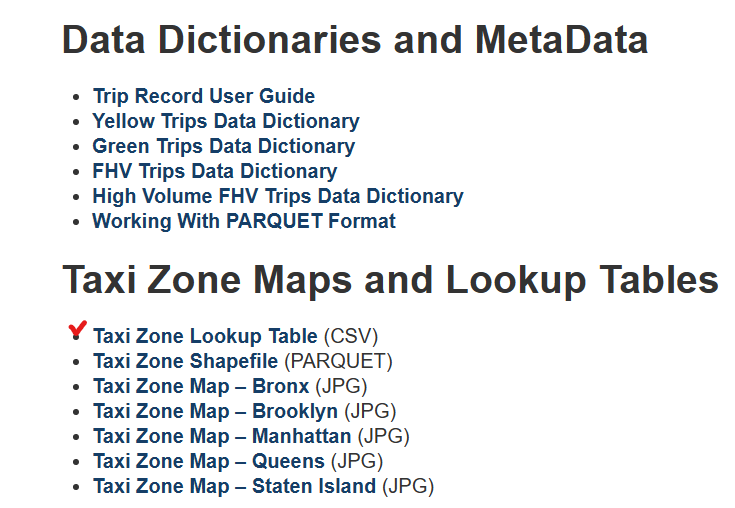
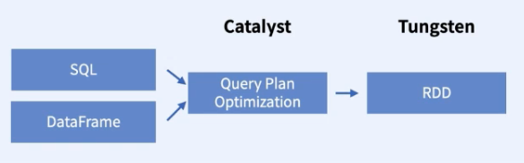
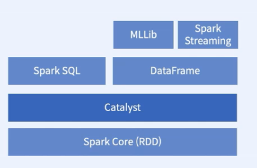
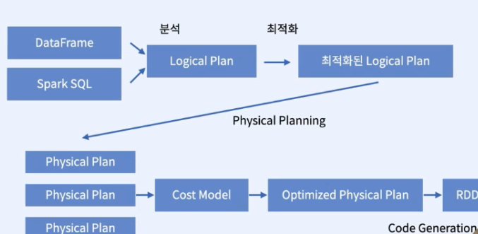
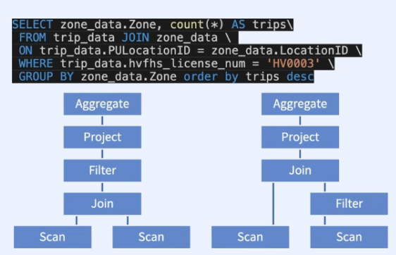
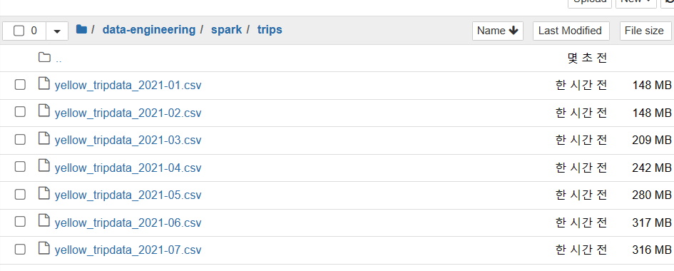

# Part3. SPARK SQL, Dataframe, Dataset

**목차**
- [Spark SQL]()
- [SQL 기초 실습]()
- [Dataframe]()
- [SQL 실습 1]()
- [SQL 실습 2]()
- [Catalyst Optimizer & Tungsten Project]()
- [User defined Functions]()
- [데이터 분석 프로젝트]()

----
### [Spark SQL]()

**Spark SQL**
- 스파크 위에 구현된 하나의 패키지로 3개의 주요 API를 가진다.
  - SQL
  - DataFrame: 테이블 데이터 셋, RDD에 스키마가 적용된 것으로 이해
  - Datasets: 타입이 있는 DataFrame, Pyspark에서는 크게 신경X
- 2개의 백엔드 컴포넌트
  - Catalyst - 쿼리 최적화 엔진
  - Tungsten - 시리얼라이저

- `RDD`에선
  - 데이터의 구조를 모르기 때문에 데이터를 다루는 것을 개발자에 의존한다.
  - Map, flatMap, filter등을 통해 유저가 만든 함수를 수행한다.

- `Structured Data`에선
  - 데이터의 구조를 미리 알고 있으므로 어떤 테스트를 수행할 것인지 정의만 하면 된다.
  - 최적화도 자동으로 할 수 있다.

**Spark SQL은 구조화된 데이터를 다룰 수 있게 해준다.**
- 사용자가 일일이 function을 정의하는 일 없이 작업을 수행할 수 있다.
- 자동으로 연산이 최적화 된다.

**SPARK SQL의 목적**
- 스파크 프로그래밍 내부에서 관계형 처리를 하기 위해
- 스키마의 정보를 이용해 자동으로 최적화 하기 위해
- 외부 데이터셋을 사용하기 쉽게 하기 위해

**Spark Session**
- Spark core에 SparkContext가 있다면 Spark SQL엔 SparkSession이 있다.

```python
spark = SparkSession.builder.appName("test-app").getOrCreate()
```
---
### [SQL 기초 실습]()

[실습 노트북](./learning-SparkSql.ipynb)

---
### [Dataframe]()

**데이터 프레임: RDD의 확장판**
- 지연 실행
- 분산 저장
- 불변성
- ROW 객체가 있다.
- SQL 쿼리를 실행할 수 있다.
- 스키마를 가질 수 있고 성능을 최적화 할 수 있다.
- CSV, JSON, Hive 등의 외부 파일을 읽어오고 변환할 수 있다.

**데이터 프레임의 스키마 확인**

- `dtypes()`: 데이터 타입 확인
- `show()`: 테이블 형태로 데이터 출력, 첫 20개의 열만 보여줌
- `printSchema()` : 스키마를 트리 형태로 볼 수 있음

**복잡한 데이터 타입**
- `ArrayType`
- `MapType`
- `StructType`


**데이터 프레임 생성**
- RDD에서 스키마를 정의한 다음 변형

1. 스키마를 자동으로 유추해서 Dataframe 생성
```python
# RDD
lines = sc.textFile("example.csv")
data = lines.map(lambda x: x.split(","))
preprocessed = data.map(lambda x: Row(name=x[0], price=int(x[1])))

# 유추
df = spark.createDataFrame(preprocessed)
```
2. 스키마를 사용자가 직접 정의하기
```python
# RDD
lines = sc.textFile("example.csv")
data = lines.map(lambda x: x.split(","))
preprocessed = data.map(lambda x: Row(name=x[0], price=int(x[1])))

# 정의
schema = StructType(
    StructField('name', StringType(), True),
    StructField('price', StringType(), True), # 사용자가 String으로 정의하고 싶을때
)
spark.createDataFrame(preprocessed, schema).show()
```

- CSV, JSON등의 데이터를 불러오기
```python
from pyspark.sql import SparkSession
spark = SparkSession.builder.appName("test-app").getOrCreate()

# JSON
dataframe = spark.read.json('dataset/nyt2.json')
# TXT
dataframe_txt = spark.read.text('text_data.txt')
# CSV
dataframe_csv = spark.read.csv('csv_data.csv')
# PARQUET
dataframe_parquet = spark.read.load('parquet_data.parquet')
```

**createOrReplaceTempView**
- 데이터프레임을 하나의 DB 테이블처럼 사용하려면 `createOrReplaceTempView()` 함수로 temporary view를 만들어줘야한다.

```python
data.createOrReplaceTempView('trip_data') # 닉네임 지정
# sql문으로 쿼리
spark.sql('SELECT pickup_datetime FROM trip_data LIMIT 5').show()
```

**Spark에서 사용할 수 있는 SQL 문**
- Hive Query Language와 거의 동일
  - `select`, `from`, `where`,`count`, `having`, `group by`, `order by`, `sort by`, `distinct`, `join`

**python에서 Spark SQL 사용하기**
- DataFrame을 RDD로 변환해 사용할 수 있다.
- `rdd = df.rdd.map(tuple)`
- 하지만 RDD를 덜 사용하는 편이 좋다.

**DataFrame의 이점**
- MLLib이나 Spark Streaming 같은 다른 스파크 모듈들과 사용하기 편하다.
- 개발의 편리함
- 최적화

---
### [SQL 실습 1]()

[실습 노트북, 단일 테이블 조작](./trip_count_sql.ipynb)

---
### [SQL 실습 2]()

- [Taxi Zone Maps and Lookup Tables CSV 파일 다운로드](https://www.nyc.gov/site/tlc/about/tlc-trip-record-data.page)
  
[실습 노트북, 여러 테이블 조작](./trip_count_by_zone_sql.ipynb)
---
### [Catalyst Optimizer & Tungsten Project]()


- 스파크는 쿼리를 돌리기 위해 **Catalyst**, **Tungsten** 엔진을 사용한다.

**catalyst**



- SQL과 DataFrame이 구조가 있는 데이터를 다룰 수 있게 해주는 모듈
- Catalyst는 **logical plan**을 **physical plan**으로 바꾸는 역할을 한다

**logical plan?**
- 수행해야하는 모든 transformations 단계에 대한 추상화
- 데이터가 어떻게 변해야 하는지 정의하지만
- 실제 어디서 어떻게 동작하는지는 정의하지 않음

**physical plan?**
- logical plan이 어떻게 클러스터 위에서 실행될지 정의
- 실행 전략을 만들고 Cost Model에 따라 최적화

**logical plan**을 **physical plan**으로 바꾸는 단계
1. 분석
   Dataframe 객체의 relation을 계산, 칼럼의 타입과 이름을 확인

2. Logical Plan 최적화
   - 상수로 표현된 표현식을 Compile Time에 계산 (x runtime)
   - `Predicate Pushdown`: join & filter -> filter & join (효율적 연산)
   - `Projection Pruning`: 연산에 필요한 칼럼만 가져오기

3. Physical plan 만들기
   - Spark에서 실행 가능한 plan으로 변환

4. 코드 생성
   - 최적화된 Physical plan을 분산 환경에서 실행될 Java Bytecode 코드로 변환




**최적화 예시**


- 바로 조인 대신 filter & join을 수행

**Explain**
- 쿼리의 Execution plan을 분석할 수 있는 함수
- `parsed logical plan`
- `analyzed logical plan`
- `optimized logical plan`
- `physical plan`

---

**Tungsten**

스파크 엔진의 성능 향상이 목적
- 메모리 관리 최적화
- 캐시 활용 연산
- 코드 생성

---
### [User defined Functions]()

- 사용자가 직접 함수를 정의하고 SQL에 적용할 수 있는 기능

[UDF 실습 노트북](./udf.ipynb)

---
### [데이터 분석 프로젝트]()

**택시 데이터 분석**
- 2021년 1월 ~ 7월까지 yello taxi data 다운로드

- parquet 파일 -> csv 파일로 변환
```python
import os
import multiprocessing
import pandas as pd


dir_path = "/home/ithingvv34/data-engineering/spark/trips"

def convert_parquet_to_csv(filename):
    if filename.endswith(".parquet"):
        df = pd.read_parquet(os.path.join(dir_path, filename))
        df.to_csv(os.path.join(dir_path, filename.replace('.parquet', '.csv')))

parquet_files = [f for f in os.listdir(dir_path) if f.endswith('.parquet')]

with multiprocessing.Pool() as pool:
    pool.map(convert_parquet_to_csv, parquet_files)
```



[실습 노트북](./taxi-analysis.ipynb)