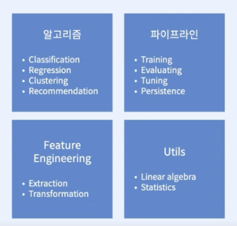
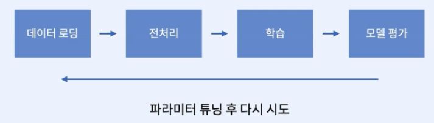
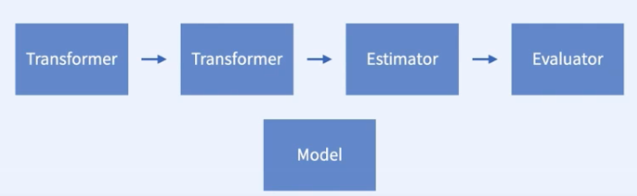
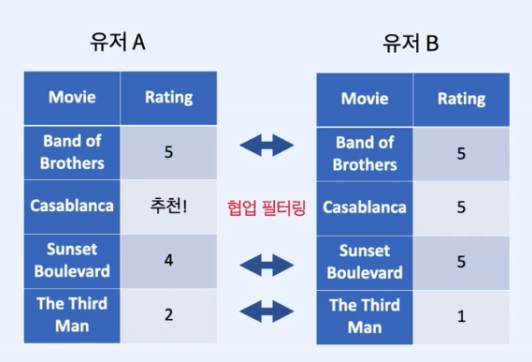
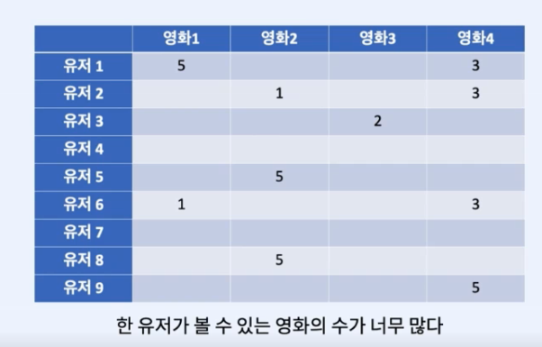
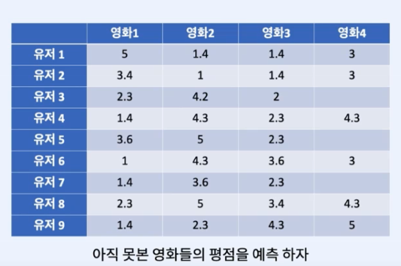
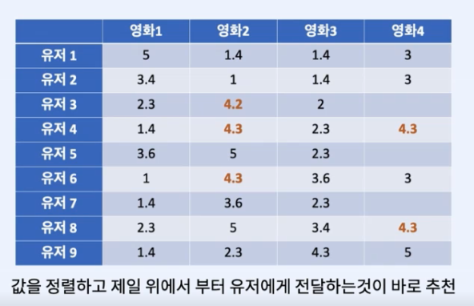
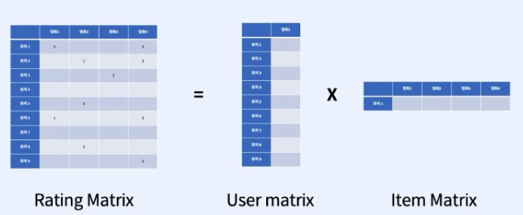
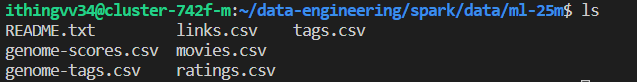

# Part4. Spark ML & ML Engineering

### [Spark MLlib & ML Pipeline]()

`MLlib` : Machine Learning Library
- 머신러닝을 쉽고 확장성 있게 적용하고 파이프라인 개발
- DataFrame을 쓰는 MLlib API를 Spark ML 이라고 부름 (RDD X)
  
**MLlib의 여러 컴포넌트**

**머신러닝 파이프라인**

**MLlib으로 할 수 있는 작업**
- 피쳐 엔지니어링
- 통계 연산
- 선형/로지스틱 회귀분석
- 서포트벡터머신
- 나이브베이즈 분류
- 결정 트리
- K 평균 클러스터링
- 추천 (ALS)

**MLLib의 주요 컴포넌트**
- Dataframe

**Transformer**
  - 피쳐 변환과 학습된 모델을 추상화
  - 모든 Transformer는 transform() 함수를 가지고 있다.
  - 데이터를 학습이 가능한 포맷으로 변경
  - DF를 받아 새로운 DF를 만드는데 보통 하나 이상의 column을 더하게 된다.
    - 데이터 정규화
    - 토크나이즈
    - One-hot-encoding (카테고리컬 데이터를 숫자로 변환)

**Estimator**
  - 모델의 학습 과정을 추상화
  - 모든 Estimator는 fit() 함수를 가진다.
  - fit()은 Dataframe을 받아 Model을 반환
  - 모델은 하나의 Transformer
    - ex) 선형회귀모델
    - `lr = LinearRegression()`
    - `model = lr.fit(data)`

**Evaluator**
- metric을 기반으로 모델의 성능을 평가
  - ex) RMSE
- 모델을 여러개 만들어서 성능을 평가하고 가장 좋은 모델을 뽑는 방식으로 모델 튜닝을 자동화
  - ex)
  - BinaryClassificationEvaluator
  - CrossValidator

**Pipeline**
- 머신러닝 워크플로우 정의
- 여러 단계를 가지며 저장(persist)될 수 있다.

---
### [Pipeline 실습]()

[LogisticRegression 실습 노트북](./logistic-regression.ipynb)
[Pipeline 실습 노트북](./pipeline.ipynb)

---
### [Recommendation Algorithm - ALS]()

**추천이란?**

    
    
    
    

---

**ALS란?**
ALS(Alternating Least Squares) 알고리즘은 추천 시스템에서 널리 사용되는 협업 필터링 알고리즘이다. 협업 필터링은 User와 Item 간의 과거 데이터를 통해 개인화된 추천을 만드는 기술이다.

---

**ALS 알고리즘**
ALS 알고리즘은 `Rating` 행렬을 두 개의 하위 행렬(`User`행렬과 `Item` 행렬)로 분해하여 작동한다. 그런 다음 두 행렬을 함께 곱하여 `predicted rating` 행렬을 생성한다. 알고리즘의 목적은 학습 데이터에서 예측 평점과 실제 평점의 차이를 최소화하는 것이다.

알고리즘은 두 행렬 중 하나를 수정하고 다른 하나를 최적화하는 작업을 번갈아 수행한다. 이는 예측 평점과 실제 평점 간의 차이를 최소화하는 행렬 값을 찾는 방법인 **least squares optimization**를 사용하여 수행된다.

**ALS의 특징**
- ALS 알고리즘은 개인화된 추천 시스템을 구축하는 데 강력하고 널리 사용되는 기술이다. 
- `Rating` 행렬이 Dense하거나 결측값의 비율이 낮아야 한다.
  - 결측값 대치, 콘텐츠 or 하이브리드 기반 필터링으로 해결
- 희소 데이터 세트에 특히 효과적이다.
- 계산적으로 효율적이며 병렬화할 수 있으므로 대규모 데이터 세트로 확장가능

---
### [Recommender System 실습]()

**영화 추천 실습**
- [데이터셋 다운로드](https://grouplens.org/datasets/movielens/25m/)
    - `movielens 25m`

[ALS 알고리즘 사용하여 영화 추천 API 실습 노트북](./movie-recommendation.ipynb)

### [예측 알고리즘 실습]()
1. v1:
   [택시 요금 예측 파이프라인 실습](./taxi-fare-prediction-v1.ipynb)
2. v2:
   [택시 요금 예측 파이프라인 성능 개선 실습 (피처 엔지니어링)](./taxi-fare-prediction-v2.ipynb)

3. v3:
    [택시 요금 예측 파이프라인 + 하이퍼파라미터 튜닝 + 모델 저장](./taxi-fare-prediction-v3.ipynb)
